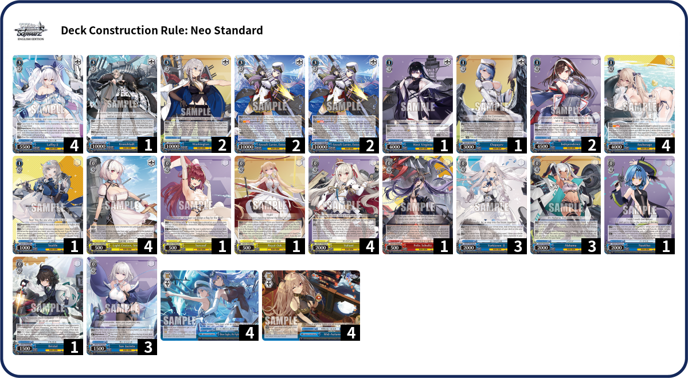
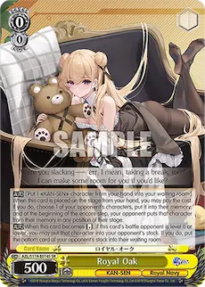
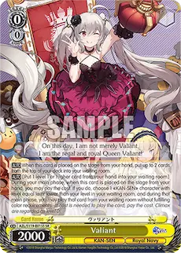
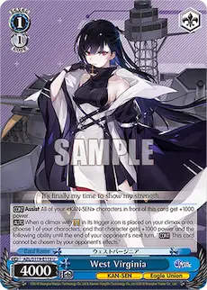
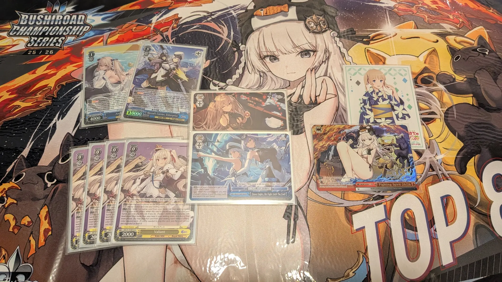

It is currently 2 days after the Toronto BCS event for the 25/26 season where I got 3rd place. I am still very sick from a flu that I got 3 days before the tournament but I really want to get my thoughts down while the memories are still fresh in my mind. Everything that you're going to be reading about is off the dome so please excuse the bad writing since I didn't get anyone to help edit this either.

### Introduction
I started playing Weiss Schwarz some time during the summer of 2023 because it has the cards of my favorite series Saekano and fell in love with the game since then. I didn't have much prior card game experience and still vividly remember my 2023 BCS experience playing Saekano into Alice and Gura meta. For the 24/25 BCS season I played Bocchi (x-3 drop) in Philly and KanataMarine (x-2) in Toronto but did not successfully make any top-cuts. In autumn of last year (2025) I got 4th place with my team in Toronto BCF trios event using a Bunnygirl deck I kindly borrowed. For the 25/26 season I was only going to play in Toronto so I really want to make it count although I'm not the biggest fan of the current EN meta.

#### Preparations
Tbh I was this close to giving up and just playing some Lycoris Recoil pile because that is the only English deck I own but I got frustrated with how the deck plays and I still really want to participate in the competition. I settled on AzurLane 8 Pants after trying my hand at all kinds of decks from top contenders like BangDream or Nikke, to strong decks Slime and ChainsawMan. AzurLane 8 Pants is a solid 1k1 deck with a cheap but explosive finisher, being able to do 7 instances with only 5 stock and 5 hand is no joke. The high amount of soul triggers in the deck will also naturally expedite the pace of the game, taking slower more grindy decks like BD, NIK, or OVL out of their comfort zone. Finally, the level 1 combo also compresses deck 1 very well to increase my chances to cancel a turn earlier than my opponent's. 

Another reason why this deck is good in the current atmosphere is because Azurlane has a lot of good tools such as adachi to counter early-plays which are very popular currently and a stockbomb with a very good pseudo bounce effect to play around tap-counters from Nikke. Plain adachi profiles are usually awkward to play but the Valiant spawner allows us to play it while still maintaining consistency. Honestly that card is what allows the deck to perform its gameplan so consistently all the way from lv0 to lv3 and is such an overlooked card. If you don't believe me, the best Weiss Schwarz deck builder I know says it himself that "\[Valiant\] is the best card in the deck", please check out Steve’s deck profile video on his channel I'm playing that exact build.

<iframe width="560" height="315" src="https://www.youtube.com/embed/94-8hD7C5xY?si=i_GWJ3ZJvbqnPjkC" title="YouTube video player" frameborder="0" allow="accelerometer; autoplay; clipboard-write; encrypted-media; gyroscope; picture-in-picture; web-share" referrerpolicy="strict-origin-when-cross-origin" allowfullscreen></iframe>

The biggest and most glaring drawback is that it lacks a decompression tool such as stockswap/stockshuffle which are insta-loss to hyper-compressed deck, thankfully most current decks in EN needs some time to be able to get there with the biggest offenders like TSK, CSM, and 7DS being heavily nerfed. It also has bad numbers into Nikke where a 7.5k Modernia (from backrow assist) can't be beat for free. To solve this issue I asked experienced players who are more familiar with AZL to help and found that the new 1/1 West Virginia 1k frontal assist is the perfect tech, especially since it can easily be played by the Valiant spawner.

With that, I played the deck for like a month straight at locals to make sure I'm familiar with any awkward situations I might get myself in.

### Tournament Day
Waking up early is my weakest point. Thankfully, my lovely boyfriend was able to drive us both to the venue - I grabbed a coffee while he got himself a sandwich on the way there. I was very sleepy and tired so after greeting my friends I kinda just stared into space until pairings were announced.

#### Swiss
Overall I would say that my swiss games were pretty normal, there were a couple wins where it's pretty obvious that I got lucky but such is Weiss. Below I'm just going to go through each round one by one and share anything that was interesting.

**R1: OVL Bar/Door 1st W**

For the first match I played against a locals which is a little unfortunate. The first thing that stood out is although I went second I only swung once to beat their 4k chaser. The rest of the game was fairly normal with my opponent setting up ainz in deck 1 with 4(?) markers. What pushed the odds in my favor is that my opponent was playing around a lv1 anti-change counter that I didn't play. As a result I got to keep my board for free on the first Ainz turn, then on the follow-up Ainz turn he popped my front-row instead of my back-row to avoid having to side. I ended up finishing the game with double finisher after a minor dmg lead.

**R2: NIK Door/Standby 2nd W**

I played against another locals in the second match as well. Interestingly enough I also went second swung once, I think what happened was that I didn't draw any rikis or any mills so I didn't want to over-commit and be stuck at 0 while not being able to answer their lv1 board. My 1/1 1k support came in this matchup to out their triple Modernia + 1.5k assist backrow, I was very happy about that. I was not ahead in dmg this game and was forced to try to go for game while my opponent was at 2-4. I was running low on resources and decided that it was the best time to go for it when I confirmed that I had exactly 4 clean triggers in deck for Enterprise. By going for game at this spot I also avoided any risk of a tap counter. My opponent cancelled a vanilla 3 off refresh then died to a 3, 3, 4 on the first finisher.

**R3: CSM SS/Bar 1st W**

Would you have guessed it I played against another locals, one of my teammates for the annual community hosted winter trio's event no less. My opponent didn't mulligan any cards at the start of the game so I was a little worried at the start of the game. Unfortunately he didn't cancel and couldn't field kishibes to out my lanes, I level'd myself from 2-4 to kill with double finisher while my opponent is at 3-2.

**R4: HOL 8 Standby 2nd W**

This was the azki/choco variant instead of polka lv1. This was also the first matchup that I was unfamiliar with but I had confidence that my deck can gatekeep random standby decks. I was able to out their lv1 board by spawning the adachi, and then outing their lv2 board by spawning the stockbomb to remove the Luna. The 1/1 1k support also helps me beat over their choco before backrow assists came out. It felt pretty good ngl to be the one in control of the game against a standby deck. Again, I closed the game with double finisher from 2-6, siding all 3 lanes to avoid the tap counter.  

**R5: TSK 8 Standby 1st W**

This is another matchup that I was very unfamiliar with since I'm only acquainted with various Mjurran variants for slime. In this match I was mostly behind, I wasn't able to out their 2/1 standby combo, ate damage, and only managed to adachi their Benimaru once. I figured that the longer this game goes the worse off I'll be, so I clock-draw to lv3 in order to try for game while my opponent is at 2-3. Unfortunately I only ended up with a single finisher after unsuccessfully trying to mill out a second Enterprise into the waiting room. My opponent unsurprisingly survived as I await my death from the double Benimaru that remained on his board into my empty lanes. My opponent fielded another 2/1 combo (ping 1 stock 1), slammed cx, and went into attack phase and as luck was would have it, both of his Benimaru revealed a cx to only burn for 1, I cancelled the swings for 4s and narrowly escaping defeat - ending up at 3-6. Afterwards I only needed to stick a 2 for game with cx ready hand and it stuck. 

**R6: TRV Dual-Lane 2nd L**

Once again I paired into a locals and good friend of mine. Having a 6 round undefeated record on TRV many of you can probably guess who this is, it is the champion of BCS Toronto in 2025 CarsonHua7645. Tbh I did not expect to play against TRV this season, there is literally only one TRV player and if I'm honest I thought that TRV would get filtered by the abundance of Bang Dream decks already. Hyper-compressed decks are the worst matchups for 8Pants AZL and this match went just as I predicted. I failed to kill my opponent from 2-5 with double finisher because I'm staring at 15 stocks that I can't do anything about, to then be completely obliterated the turn after. Nonetheless, at this point I was happy that my chances of making the top 16 cut is practically guaranteed. 

**R7: 5HY Miku 1st W**

Honestly, no flame and much love to my opponent, but this was the weirdest game of Swiss by far. My opponent went second, trilane with clean-cut and slammed cx, fair. But then he tri-lane and slammed cx again after being stuck at lv0, and then at level 1 slammed cx again after fielding only a single combo. Unfortunately I also cancelled a lot so his risk didn't pay off, plus I bet there was just a lot of cxs in his hand. He then played the rest of the game with only 2 hand from that point onwards because brainstorms didn't hit. To add salt on the injury I even blinked his backrow marker support the turn before he hit lv3 so that his finisher couldn't be cheated out. Finally, I closed out the game with my first triple finisher of the day to kill from 3-1 and secure top-cut. 

#### Top-Cut
Contrary to my swiss games, I tri-laned like a psycho going second because I felt that pushing damage early and playing for a faster game would favor me against these 1k1 decks that I was up against.

**T16: 5HY Itsuki 2nd W**

The start of the game went pretty normal. I managed to squeeze out a resource lead because my opponent's first turn of double Itsuki combo milled one cx each. At level 2 they also decided to spend stock to heal down instead of conserving resources, however, I was pushed to 2-6. At this point I had the choice to go for game with double finisher like usual but my opponent was sitting pretty at 2-3 with decent compression in the rest of his deck. I noticed that my opponent only has 4 stock with one of the Itsuki finishers in level, a second one stuck in the second stock and the third one is in the waiting room about to be refreshed into a fresh deck. Since my opponent is also low on hand I estimated that the odds that even a double finisher is very low. I decided to stall for another turn because I will for sure survive a single Itsuki thanks to being pretty compressed myself. 

As luck would have it, after clock drawing for turn, my opponent played the first Itsuki finisher to stop and add the first card it excavated to then played that exact same card down as the second Itsuki finisher. I'm left sitting there cursing myself because my chances of losing more than tripled, praying for cancels in my deck. That turn went as follows: burn 3, cancel, moca 2, clean, swing for 3, take, burn 3, take, moca 2, mills 1, swing for 3, cancel, side for 2, cancel. This experience was the most scared I've ever felt playing Weiss Schwarz, my heart was racing, I was begging and praying to all kinds of higher powers. I really really didn't want to go out like this, not after taking a calculated decision that I knew would've won me the game with the lowest risk. After my opponent passed the turn back to me, I closed it off with triple Enterprise for game, ggs!

**T8: BD Bar/Pants 2nd W**

Surprisingly this is the first Bang Dream matchup I played today despite it being the dominant deck of the season. There were surprisingly very few Bang Dream decks in the top tables during Swiss as well. I had a strategy coming into the tourney against Bang Dream and it is to tri-lane aggressively turn 2 and taking out non-triggers from my deck during the first combo turn in order to push damage. I think that Bang Dream's weakest point is their lack of sculpting, causing them to often rely on hitting brainstorms in a compressed deck in order to sculpt finisher pieces. Fortunately for me this strategy worked too well and my opponent didn't cancel at all and got shot to lvl2 on turn 3, to then refresh with 6 cxs, and arriving at lv3 shortly after - all while I was still at 1-2 or so. It was a very tragic game, during the final turn he had to heal down from 3-3 with ep-heal + single Tomori. I ended up clocking myself up from mid 2s to do double finisher and winning the match.

**T4: SFN 8 Pants 2nd L**

Funnily enough, although Frieren isn't a popular deck to play in EN I had a lot of experience against it because my bf is also playing it for the event. The important thing to note is that their torch counter allows them to mill out of deck 1 very easily and not get punished for leaving clean cards after comboing. As a result the strategy I'm going with is the same one into Bang Dream. For this game in particular I tri-laned with like 2 brainstorm on turn 1, and we were both stuck at 0 so I even did spawner -> stockbomb to out their Himmel JC. Since I have a lot of soul triggers in the deck I also have good side value into their lv1s to avoid torch counter and was able to punish that when he had 3 clean after the first combo turn. While I was ahead, eventually Frieren managed to stabilize thanks to how easy it is to loop their combo. My compensation is that I was able to build up enough resources to go for triple finisher at this point and decided to pull the trigger. 

The finishing turn was a bit of a blur and I don't remember the numbers correctly but I saw that my opponent will be refreshing without clock compression to level 3 after the first burn - they're currently somewhere in the mid 2s. I refreshed into a new deck with 6 cxs, put down double finisher, and decided to dig for the third cause that was my ceiling. I found it within a couple cards. After playing down the third finisher I thought that I had this game in the bag for sure and entered the attack phase. I hurriedly declared a side attack before doing the effect of my pants support to top-check my deck and missed the timing, all is fine I thought... this game is about to be over either way. For the first finisher I triggered a character and a climax. For the second finisher I triggered a cx and another cx. Then for the third finisher I triggered a cx and a character. My dreams were crushed as my ceiling of 9 instances became 5, and as my swings of 4s and 5s were cancelled by a modestly compressed deck. I passed the turn over and had 2 cancels left in deck to withstand the wrath of triple booster-box Frieren finisher and unsurprisingly died. I really thought I was going to Japan for sure q~q

**Third Place: TRV Dual-Lane 1st W**

As I mourn the loss of my invite and my potential sponsored Japan trip, and cursing myself for being too good at this game and being too compressed I noticed that in front of me, my 3rd place opponent was in an even sorrower state. This final match was a rematch with the defending Toronto champion CarsonHua7645 on what I consider is my worst matchup. I quietly accepted defeat but kept it to myself as I asked what happened with their game while I shuffled my cards. At this point I was in a state of Zen, I was sick under a mask all day, I haven’t had any food but 2 cups of coffee, and I just had the worst defeat of my life - I just wanted to get out of here and rest. And this might sound cap but I was happy that at least someone I know will get the invite to Japan instead of having to fight a stranger for it.

The game started and I didn't feel any pressure at all. Don't get me wrong I am still playing to win and will not go down without a fight. I have it written down in my notes that my "opponent had bad deck 1" but I also got lucky and got good cancels. Outside of luck I did make a couple good decisions during the first couple turns of this game. At level 1 I had two cxs in hand along with two level 1 combo, and a stock-charge, normally that would be the perfect hand to just put down but I decided instead to riki for the second stock-charge and not fielding any lv1 combo at all. I figured that since my opponent will be dual-lanning from this point onwards I don't need immediate hand-plus for anything, and this is also the only chance for me to farm stock-charge because I won't be able to reverse any of the dual-lanners later on. Furthermore, I am saving my hand to field double combo + cx next turn to at least force a counter in order to burn my opponent's hand -  it’s very hard to reach 7k with any other cards in the deck. Finally, my strategy later into the game is to remove soul-triggers from the deck after TRV enters deck 2 so that I can hopefully stick some damage into their compressed deck, and focus on healing down with my excess stock. 

As the game went on, I cancelled a couple 4s and 5s as I slowly push them to level 3. My opponent did get a lucky triple cancel in deck 2 so they managed to stabilize a bit after playing with only 2 hand for quite some time. The critical point came when Carson is at 3-2 with ~14/15 stock, enough for triple burn + combo while I was at 2-0 with ~12 stock myself. The biggest problem for Carson is that their only stockswap got hit into clock with no way to get it. I wasn't sure if it's nerves, sadness, or dread or all of the above but Carson miscounted the amount of cxs I have left in my deck and decided to stall for another turn to swing with dual-lanners. I was way less compressed and only had 1 cx left in deck so I took a 4 from the first swing. I was then given the easy decision to go for game with fumio + triple finisher and walked out of that match as the victor. I knew that I needed a miracle to win against TRV and I got it.

{: .middle}

### Afterthoughts
It's honestly insane that I managed to secure an invite to Worlds, being top 2 of a regionals was this close within my grasp too. I do have to confess that I don't actually know the Azur Lane series well at all. However, I did buy vol2 in jp when it came out because boat girls are cute. I'm not trying to prove a point or represent this set or anything, so I apologize if some people were hoping for that. I'm also not trying to be anti-meta or anything for not playing t0 decks like BangDream or Nikke, but I do have a soft spot for good decks and cards that people might overlook - Band Dream mirrors are also mind-numbing. For important tournaments like BCS I will only play deck that I think gives me a winning shot and Azur Lane 8 Pants happened to be the one this season. 

I'm really excited to be able to play at the most prestigious Weiss Schwarz event, and to attend CardFest in Japan!!! I honestly can’t wait 🥰

