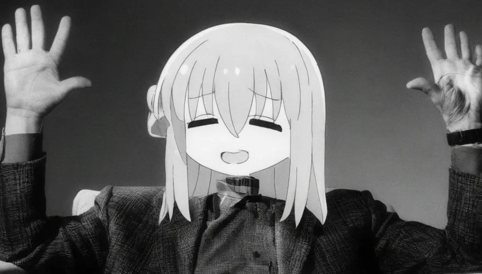
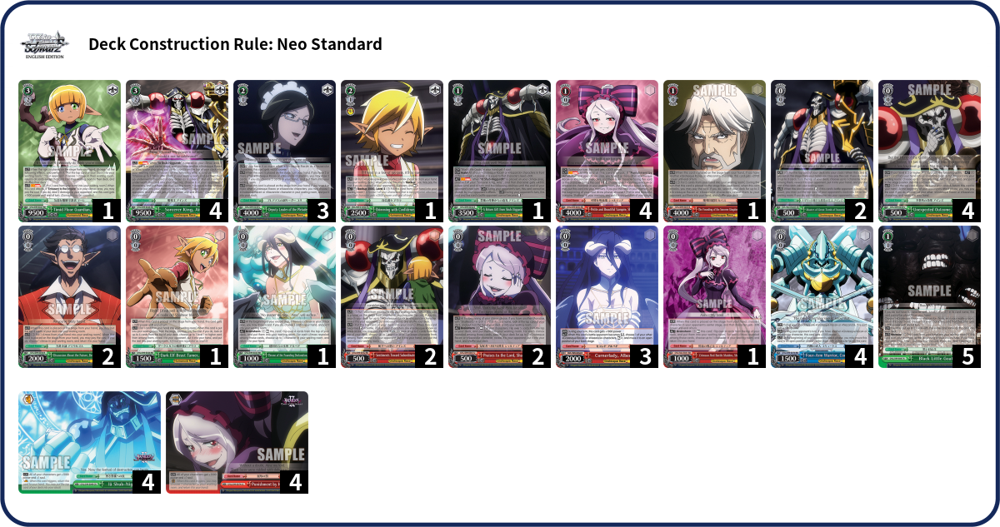
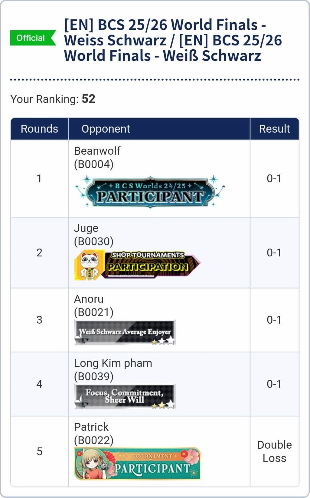

After placing 3rd in Toronto to secure an invitation to Worlds 2026, the big day finally arrived. On May 2nd, I participated in my first Weiss Schwarz Worlds and to everyone's surprise I managed to achieve a spectacular result!

This is the story of how I went 0-5 at Worlds 2026 and the events that unfolded. 

### Introduction
On my 3rd anniversary of playing Weiss Schwarz I managed to make it to the most prestigious event of the year, Worlds. This is the final arena where top players battle it out one last time in Tokyo to claim the all-mighty champion title along with infinite bragging rights. Being here is a huge achievement for me as someone who is hopelessly addicted to this anime trading card game. Needless to say, I love Weiss Schwarz, and I love Japan even more. I got an excuse to have another vacation to Tokyo this time to see beautiful flowers, buy new shiny cards, and have incredible food. Nevertheless, playing at Worlds (and CardFes) is the main highlight and I wanted to do my absolute best!

### Preparations
At first I was going to bring Azur Lane ([**the same deck I got my invite with**](https://mastershoty.github.io/weiss/blog/torontobcs2026/)) or somehow piece together Oshi No Ko, but then BushiSEA in all of their infinite wisdom decided to [**"nerf"**](https://en.ws-tcg.com/information/010426/) Overlord (OVL) and gave hope to the few remaining loyal subjects. I won't lie, I'm a meta-sheep. I'll play the best deck if I can, or at least settle for a strong contender. 

Overlord's Ainz is a pretty unfair deck with how uninteractable the [**3/2 Ainz**](https://en.ws-tcg.com/cardlist/?cardno=OVL/S99-E028) is, how they can sit on tap-counter with a walling board, how they can have up to five ping 1s ready at their command, how your board will get deleted, and how a cancel can give them an extra mile compared to yours. In the JP's format this deck was officially killed after multiple bans, while in EN the problematic [**1/1 Ainz**](https://en.ws-tcg.com/cardlist/?cardno=OVL/S99-E032) is limited to 1 copy but players still has the ability to play either the [**2/1 Yuri Alpha**](https://en.ws-tcg.com/cardlist/?cardno=OVL/S99-E039) or the [**1/0 Maid**](https://en.ws-tcg.com/cardlist/?cardno=OVL/S62-E062) package. Heading into the 2026 Worlds EN meta, I feel that Ainz is great at punishing 1v1 decks like BanG Dream (BD) or Oshi no Ko (ONK) by punishing backrow brainstorms, it also feels comfortable sitting on a tap-counter against their finishers. Furthermore, the deck is amazing at gatekeeping the Standby decks that are popping up to counter the dominance of the aforementioned tier-one decks. However, it is worth nothing that ONK has amazing tools to minimize losses or be annoying with efficient [**bouncer**](https://en.ws-tcg.com/cardlist/?cardno=OSK/S121-E073) and [**grappling-hook**](https://en.ws-tcg.com/cardlist/?cardno=OSK/S121-E034). 

I’m not an Overlord player and I've never piloted the deck in a tournament setting. However, I’m confident I can pick it up and play it at a competitive level. Luckily for me, there are a couple of OVL enthusiasts at my locals to help and give me advice, [**one of whom**](https://x.com/ENENE_15/status/2019632723120304136) is also going to play OVL at Worlds. This switch to a new deck is pretty sudden since I only have around 2 weeks to learn and practice before I fly out to Japan a week early before Worlds. I wanted to prioritize my vacation so I didn't intend to spend a lot of time playing cards outside of the tournament. So, after testing and tweaking the level 0 lineup to one I’m happy with, I packed the deck below and hopped on a 20-hour journey from Toronto to Tokyo.

### Tournament Day
Let's get right down to business.

I woke up at 7:30am to get ready. It takes 1 whole hour to commute from my accommodation to the Tokyo Big Sight venue and check-in closes at 9:30am. I arrived around 9:00am on schedule and went to a nearby conbini to pick up a hashbrown and coffee for breakfast. Along with it I also grabbed an egg sandwich in case I get hungry later on. After taking some time to relax, I headed back to the venue and anxiously waited for my first game.

**R1: OVL Bar/Door 1st L**

As luck would have it I paired against one of the legends [**Beanwolf**](https://x.com/Beanwolf) himself. Funny story, I've never met him in person before but I ended up running into him twice during my first week in Tokyo, once in Shibuya and once in Ikebukuro. I guess us Otakus just like hanging out at the same places. Anyways, we sat down, exchanged pleasantries and proceeded to mulligan. At this point I realized that he's playing Overlord and I'm also playing Overlord. It's a mirror. I'm freaking out because I know that he'll spot any mistakes that I'll make and punish them. Thankfully, I won the coinflip for first/second so maybe that will improve my odds. 

The early game was pretty normal as we exchanged some plussing 0s and did lv1 combos. I cancelled early so it was looking like he'll Ainz first on deck 1 after double combo and presenting me with 2 empty lanes while at sitting around 1-3 or so, a great position to be in. On my turn, I slammed a door myself with one Albedo and he triple cancelled to stay at lv1, this is a less ideal position for Beanwolf to be in. On the next turn, I leveled to low 2s and had the opportunity to Ainz first, the only problem is that I had to Ainz on a fresh deck. Luck was on my side as I managed to get 3 goats into the waiting room and then at the beginning of climax phase even got the fourth off my Shalltear brainstorm top-check effect. All the sudden, I'm in an amazing position as my opponent took damage and go to mid 2s!

On Beanwolf's following turn, thanks to careful resource management he was able to double Ainz in order to heal out of lethal range. He also managed to mill down to a small deck in order to keep clock-compression and left a deck that is 1 in 4 after triggering bar to secure the follow-up Ainz turn. The odds suddenly turned against me as I couldn't find cancels and leveled to 3-2. All of the sudden I'm up against a wall, I need to end this now or else I'm dead for sure next turn especially since tap counter is useless as my board is getting blown up. Any swing I take is guaranteed death. I analyzed my options and concluded that I needed to ping out the last cx with Ainz in order to have a chance, however, I struggled to find a second Ainz after triggering two the previous turn. I lacked salvage options and mill to enter the next deck. Without any other choices I played the drop-search I had in hand anyways in the off-chance I miscounted and there's somehow still another copy in deck, there wasn't. 

With no options left I slammed bar, 25% chance to ping out the cx, it didn't, I swung for 3, he'll cancel, he flipped 3 clean, huh? It turns out that the last cx got blind-stocked lmao I love Weiss. He's refreshing 6 I just need one of the two swings to go through in order to threaten lethal with ping-1s. We are so back! Refresh point, damage resolves, level, swing for 3, cancel, swing for 3, cancel. 

It's doomed. 

I did goat burns once or twice for fun and passed back while praying that I'll triple cancel somehow. He Fumios my thick waiting room and double Ainz, absolutely no mercy. I leveled to 4, ggs.

**R2: DDD 8 Bar 2nd L**

I've played against DanDaDan only once or twice when it came out in JP so I'm not very familiar with the set. I had an idea of what the deck does, but I was still constantly reading cards so this game was a bit of a blur. To start off the game I remember cancelling early and failing to draw a Gate for Albedo combo. Entered a critical turn at mid 1s, I had only had 2 cxs left in my relatively thick deck (like 20+ cards or so). Since I can't do lv1 combo I tried to conserve hand by swinging with the Ainz bouncer along with two Albedos to beat board. This is a big misplay and it was two-fold, I will break it down. 

My Ainz bouncer was already on board since I clean-cut'd him the previous turn. I decided to push him up and swing in order to preserve hand. My thought process at the time is if I don't trigger then I'll double bounce and probably get a cancel, or if I triggered then I can bounce it along with a backrow to conserve some damage. I ended up triggering once, however, I forgot to put down another backrow so the only valid backrow that I can bounce is my 1/1 Ainz. I really didn't want to use an extra stock to replay him. Thus, I was forced to bounce two of my front-row and pray that I'll cancel with the last CX in my deck - I didn't. I took 4, 4, 3 and went to 2-6.

Looking back, even the decision to swing with the bouncer was incorrect in the first place. I won't lose if I play on 1 hand, but I will lose if I fail the coinflip chance to cancel with my last cx and take too much damage. Furthermore, I underestimated the amount of damage DDD is able to put out as the deck plays a high number for soul trigger for their finisher. On the following turn I clocked for hand but mainly for mill and did Ainz at lv3. I had very few resources and not enough stock for tap counter. My opponent then took damage on demand and jumped to level 3, he proceeded to present triple [**Aira finisher**](https://en.ws-tcg.com/cardlist/?cardno=DDD/S118-E023) and closed out the game. I was in a tough spot anyways even if he didn't level because there was already enough resources for double [**fusion**](https://en.ws-tcg.com/cardlist/?cardno=DDD/S118-E027) after his previous turn of triple lv1 combo. As a result, I started the off tournament 0-2, sad, and zero hope of making top-cut.

**R3: OSK Door/Pants 1nd L**

I finally got play against the undisputed best deck of the format, Oshi No Ko! I'm pretty familiar with the deck and I got some practice against it before I left for my trip. I was still sad from my losses, but my love for Weiss kept me excited to play more. My memory from this point onward is pretty hazy so I will only share the key moments. 

To start off the game my opponent and I traded small swings. My opponent literally swung once going second and then I swung twice back. On my first combo turn I was in a really good spot with double Albedo but unfortunately I triggered the 1/1 Ainz on the first attack. I actually had 4 stock in total so I wasn't too worried, I knew that I'm still able to grab and play him as long as it's not the bottom card of my stock. I don't remember the specifics but on the following turn I couldn't get the 1/1 Ainz down board so I had to delay the Ainz combo turn. I might've messed up somewhere along the way or I just didn't get the right cards in hand, but I remember digging for a goat event. It was still alright though since I got the 1/1 Ainz ready in hand by the end of the turn. I wish I had a detailed breakdown of what happened such as the cards I had in hand, my waiting room, etc so that I can see what went wrong but I didn't take proper notes >\<

Anyhow, on the next turn I did Ainz with 5 markers and refreshed with 6 cxs. On the turn after I didn't cancel, proceeded to double triggered, and pushed my opponent to lv3. I considered skipping the last swing to level lock my opponent but he was in the position level anyways if he clocked and milled out the couple cards left in his deck. My opponent proceeded to spend the next turn doing some Yugioh to mill out the deck, bounced a lane, and presented triple [**Akane finisher**](https://en.ws-tcg.com/cardlist/?cardno=OSK/S121-E067). Unsurprisingly, the damages stuck and I lost. 

**R4: OSK 8 Pants 1st L**

At this point I was crashing out and trauma-dumping to anyone that would listen. Why is drawing Albedo so hard, why can't I cancel, how am I so good at double triggering, why am I not compatible with Ainz, etc. I could've dropped, but I still wanted to play more, I genuinely really like and believe this deck although it hates me.

Round 4 pairings came out I got paired against a player that goes by "Long Kim pham". I don't recognize the name but my friend noticed and told me that he's the goat from Cal. "Okay then why is he 0-3 pairing into someone like me?". It made me reminisce back to when I was new to Weiss Schwarz. It was a case tournament (big deal for me) where I went 0-2 and for the third round I'm sat next to two BCS champions and a top 4 player. I displayed my shock while they all shrugged their shoulders, sometimes Weiss do just be like that. Anyhow, I found my seat and started setting up. We chatted a bit and I found out that he was having a rough time outside of card games, but he also got unlucky here and there today as well.

"It's no excuses though", he said. What a champion mentality.

He was playing a list that was a little different from the standard meta Door/Pants list. While the Akane top-end was the same, the advantage combo was the [**Lv1 Akane**](https://en.ws-tcg.com/cardlist/?cardno=OSK/S121-E071) that gives a character on-reverse search. I think that the advantage of this build is trading the brainstorm 5 for a combo that can plus from the back row, early deck 1 compression, and being able to free up some slots to include more one-ofs and tech cards due to better selection. The set 1 [**Ruby brainstorm**](https://en.ws-tcg.com/cardlist/?cardno=OSK/S107-E001) can also boosts total soul output per turn, allowing observant players the ability to punish poor deckstates. However, the bulk of the shell remains the same. 

There were a couple interesting interactions in the first couple turns. I noticed that my opponent plays the [**Lv0 Kana Aqua-Riki/Grappling-Hook**](https://en.ws-tcg.com/cardlist/?cardno=OSK/S121-E034) as I entered my lv1 combo turn. I had 1/1 Ainz in hand and a couple goats that I need to play in order to handfix so I took a bit of time debating on whether to play the 1/1 Ainz or not due to the threat of grappling hook. Life would've been easy if I didn't need to commit 1/1 Ainz and do Albedo + Albedo + Ainz-bouncer or Chaser to deny reverses but alas nothing is that easy. I ended up playing the 1/1 Ainz down to do double Albedo and not send them to memory so that my 1/1 Ainz is protected. Funnily, OSK also have a sinker on a red [**Lv1 Akane**](https://en.ws-tcg.com/cardlist/?cardno=OSK/S107-E049) which my opponent could've used to sink frontrow then grappling-hook backrow but I was just hoping that he didn't play it in his deck, he didn't. Hindsight, it was probably better to just do single Albedo with Ainz-bouncer so that I can deny my opponent reverses and take the -1 stock if my opponent want to commit grappling-hook and lose more hand.  

My opponent ended up getting a reverse in exchange for me keeping the 1/1 Ainz. He proceeded to then search out the [**3/2 Abiko**](https://en.ws-tcg.com/cardlist/?cardno=OSK/S121-E084) that blows up both players board along with the [**0/0 Yoriko**](https://en.ws-tcg.com/cardlist/?cardno=OSK/S121-E076) which allows Abiko to be early-played. This is an amazing counter to 3/2 Ainz. While Ainz is hexproof, Akibo's effect is non-targetted so he would be removed anyways. These cards caught me extremely off-guard. On my turn I had no choice but to do the Ainz combo since I didn't get the double plus off Albedo. I also had to be content with swinging even just once to keep my opponent at lv1. I ended up getting two swings and pass on the last one to keep him at 1-5 because there was a cancel. 

My opponent looked to be in a pretty bad spot because he ended the previous turn with only 4 hand and 3 stock, two of which are currently bricks. He didn't have spare lv1 combos in the backrow either because he fronted with them, expecting that they would be blown up on the following turn by his own Abiko. He is however up on damage. I was at mid 2 and needed to cancel. I didn't cancel. I got hit to mid 3 and then on my turn I once again double triggered. All the sudden my opponent is also at level 3 going for finisher. It is pretty scary but thankfully he only had enough for a single finisher. 

He slammed cx and enters attack phase. He had 6 hand. He fronted with Akane and declared combo effect. I called him out on handsize. He swung with vanillas. I took 2 swings and died. Overall was an exciting game, GGs.

**R5: BD Bar/Pants 1st Double-Loss**

I am in a state of Zen. Weiss is a game of probabilities and sometimes the odds didn't go your way. Sometimes you misplay and actually get punished. Some days you're just unlucky, some days your opponent is more lucky. I had nothing else to lose but more of my own ego so onward to game 5!

I'm paired up against Bang Dream, a set that recently got hit by the banlist but is still in a very strong spot. My opponent was really nice, even though we're both 0-4 we're still expecting a good fight and oh my it was a banger.

The early game wasn't very interesting so I'll skip forward to when we reached lv2. I did Ainz combo and got a cancel with a Bar in hand so I sat at mid 2s and slammed bar again. My opponent proceeded to triple cancel. On his turn he didn't slam cx so I was able to stay at lv2 for another turn. I drew into another Bar and spawned a second Ainz to heal back down to mid 2s. My opponent cancelled again to stay at low 2s! Now it's my turn to triple cancel as I was in a very good deck state to continue chilling at level 2. I somehow got another Bar and healed down again, this time to low 2s myself! 

Finally my opponent leveled and decided to go for game with triple [**Tomori**](https://en.ws-tcg.com/cardlist/?cardno=BD/W125-E071) but at this point time was ticking down - we did get many many turns at level 2. We were both so extremely compressed that my opponent got six burn-2s or so while I cancelled most of it and barely leveled to 3. At the end of his turn a judge was already hovering our table. Although my opponent offered to take the loss we were forced to go report a double game loss. 

I knew that we were going to be overtime during my opponent's final turn. However, I didn't want to say anything or rush my opponent though because I wanted to see whether I would die to his insane compression to go 0-5, or take a double-loss to go 0-5. Either way it was gonna be cinema and this was a crazy game. I think that we both enjoyed the match a lot regardless of the final result. We even took a photo together afterward, since he asked for pictures with all of his opponents to keep as a nice memory. It feels really warm to see that others are treasuring their moments at worlds instead of solely focusing on the results. Worlds itself is a celebration afterall, I will learn to be less of a sore loser!

I felt that this was the perfect spot to end my experience at Worlds on. I dropped the 6th final game to walked away with a 0-5 result, closing it all out with a beautiful double-loss! 🎉

[{: style="width: 450px"}](https://x.com/Master_Shoty/status/2050505648769487109?s=20)

### Afterthoughts

Am I sad that I couldn't get a single win this tournament? Of course. Am I disappointed in my performance? Not really. Do I hate Weiss now? Not at all. While I think that I got a bit of an unlucky streak, it is the randomness and probabilities in Weiss that made me fall in love with this game. I think that being able to manipulate your odds is incredibly rewarding and is a mechanic which few games have. However, a 90% chance to live your opponents finisher means that you'll still lose 1 in 10 times, it is just part of the game. Can't win them all. 

Overall I had a blast going to Worlds. Flying to Japan to be at the biggest event surrounded by fellow gamers was incredibly exciting. Unfortunately, since I'm not very outgoing so I didn't socialize much - I also don't know many others in the global Weiss Schwarz community. I did get to say hi to cool content creators like [**Chairman**](https://x.com/tudousimu), [**Shizukatz**](https://x.com/ShizukatzWS), and [**Beanwolf**](https://x.com/Beanwolf) which was awesome. Finally, everyone that I played or interacted with were also very kind and chill. There were a lot of multi-time World's participants along with first timers like me. Oh the photobooth that they had on venue was really cool as well, we were able to take pictures and get them printed as custom Weiss cards. I brought a lot of custom cards home. 

On the competitive side it was really interesting to see the decks people bring to the biggest tournament. There were some cooks like 8 Standby Fujimi or the OSK 8 pants variant that I played against. Even though it was recent, looking back on the experience fills me with emotions. Being able to participate in Worlds and Cardfes was big bucket-list item for me, I truly feel so blessed and lucky that I got the chance participate.

### Shoutouts

I'd like to give a big thank you to the incredibly kind people who helped me prepare for Worlds.

[**Realhours**](https://x.com/realhourss) for lending me your OVL deck and OVL insights. 
[**Yuiko**](https://x.com/Hakami_) for lending me your AZL deck, your OVL cards and OVL insights. 
**Danny** and [**Enene**](https://x.com/ENENE_15) for last minute practice and meta insights. 
[**Shiki**](https://x.com/isPiggy) for flying with me to Japan, playing Weiss with me, and always being there for me. 

Lastly, thank you to many many others in the Toronto community whom I've always got a lot of help and support from. ❤️
