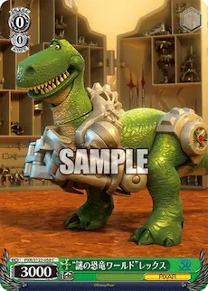
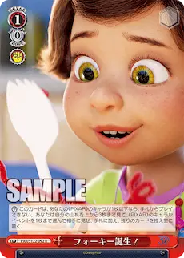
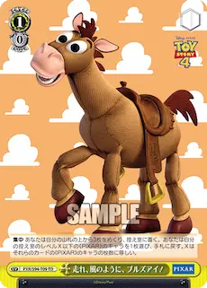
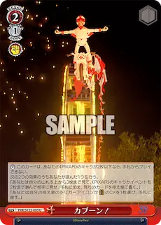
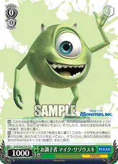
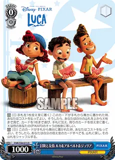
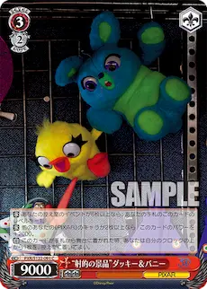

<link rel="stylesheet" type="text/css" href="../../style.css">

# Pixar Events (Door / Bar)
Are you sick of these decks that brainstorm twice every turn, generate infinite resources, then mill out and sit on their compression without any consequences? Have you ever wish that maybe Weiss is a bit more interactive, maybe bully your opponent a little bit and make them pay for being greedy? Well with this event focused Pixar deck you can that while also brainstorming every turn, gaining an obscene amount of resources, and milling out every turn. Usually events are tricky to play WeissSchwarz because there are few ways to get them into hand other than drawing them for turn or using a combo that adds a specific event. Thankfully, the Toy Story 30th Anniversary set added more ways to dig for them and it also comes with new exciting events that either helps with consistency or allows us to bully the opponent.

## Overview

#### The lv1 combo, Ducky and Bunny

*On attack with cx, top-check deck to salvage the level shown or lower, then optional hand to stock, then if the revealed card is an event then draw 1. Requires 3 or more other characters.*

This is the bread and butter of the deck and what it is built around. Our lv1 combo is a conditional plus 2 hand that also allows us to convert hand in order to gain up to 6 stock a turn. Generally in Weiss Schwarz generating 3 stock a turn is the base, so being able to gain more stock a turn without having to swing with a different card like a stock-charge profile is a great bonus. The catch for fully utilizing this insane advantage combo is having to play a lot of events, a deck building restriction. While lv1 combos that plusses 2 is nothing new (such as Chloe or more recently Saki and Modernia) there is surprising flexibility in being able to gain more stock or hand, and being able to pick what goes in stock. A common drawback to these types of combo is poor card selection, however since we don't play any other lv1 or lv2 characters it is less noticable. A second big drawback is that the combo effect offers no mill on its own, but you'll see that this won't be a problem after looking at the rest of the deck.

#### The Brainstorm
  
*On play ditch 1, search vanilla from deck. Brainstorm 6 if there's a vanilla, salvage per cx hit*

What is better than brainstorm 4? Brainstorm 5. What is better than brainstorm 5? Tap-self brainstorm 6, salvage per generic cx hit. We've seen the rise of brainstorm 5 recently in 2024 & 2025, however, they are often locked to specific cxs or needing to tap 2. For us, the demerit is that the vanilla t-rex has to be on the field in order to perform the brainstorm. Experienced players would already know how broken brainstorm 6 is, one stock can convert to 50% more resources, 50% more mill, and much lower variance on missing brainstorm and being sad and broke and lonely. Btw the styracosaurus brainstorm also bonds to the vanilla t-rex allowing us to search for it from deck, so we'll always meet the condition to use the brainstorm. As a cherry on top this effect also serves as a ditchout or hand-filter for an early body.

#### The events
As mentioned earlier, this deck needs to play a lot of events so that we can take advantage of being able to plus 2 off the lv1 combo. In total my build plays 15 events which feels like a sweet-spot, but feel free to play more or less depending on how greedy you feel.

*Check 3 add 1* *Brainstorm 3, salvage lvl equal to characters milled* 

Deckspeed good. Spork event can add events and is a counter. Yellow Bullseye event makes it very easy to loop combo or add 0s.

*Pay 1 to check 3 add 2, or salvage a gate*

Slamming a cx every turn is how we keep generating an unfair amount of resources and this event helps with that. It is also emergency mill or stockout, and can add events.

*Pay 1 sac 1, send 1 opponent's character to memory.*

I love it when cards are flavorful in Weiss, I'm bullying my opponent and making sure that they can't play with their toys. Your brainstorms and cool backrows are going to memory. Your early plays and standbys? In memory. Uninteractive finishers like these cool new anti-burns or counters? Goodbye. *"But it's so expensive 2 hand 1 stock can't be worth it"*, lucky for me this deck generates up to 6 stock 3 hand a turn + whatever the brainstorm 6 hits. While other decks prefer to save resources for an explosive finisher, or healing down, or on the rare occasion go all out at lv2, this deck makes it annoying for the opponent to play the rest of the game instead.

*Pay 3 stockswap, salvage 1.*

Last but not least, having to access to stockswap before lv3 is always a treat. Yes it's not [buns] but our opponent must always respect the stockswap, and we generate enough stock to be afford it easily. The bonus of salvage on play makes it hand neutral and can grab a finisher or loop combo at lv2. This deck plays the event in yellow from the previous set but the same profile also got reprinted in red in Toy Story Anni. Playing yellow here is important because the color is needed for our lv1 tornado event. 

#### The finisher, Buzz & Jessie
*On play check 3 add 1. On attack pitch 2, mill opponent's bottom 4, burn x+2 for every lv0 milled.*

At first glance this isn't a very exciting finisher, but it comes with many perks. The on-play effect means that we'll always find the cx or look for a stockswap or bully event. Icytail-type finishers is famous for being able to ignore the opponent's deckstate. Interestingly, Buzz & Jessie also guarantee at least a burn 2 despite being an icytail finisher so we will always have reach even if 0cxs are milled, and thus work equally well even into a stockswapped deck with few cxs.

#### The lv0s
*On play or on waiting room, pay 1 clock top deck, check 5 add 1.*
 
One of the most amazing riki profile so far, there are two separate trigger timings and this card can mill up to 10 cards on its own. We can also add events off the effect. Incredible design by Bushiroad.

*On play gets 1000*x per opponent's character. On reversing opponent, pay 1, check 2, opponent picks one to add to hand.*

This is a nice beater that can also give us some hand and offers some mill. Our sheep can grow pretty big, allowing us to beat most lv1 combos if we can't field triple ourselves.

 

Mater is a Riko profile, mainly used to loop brainstorm or filter for 0s. Our chance of revealing a lv1 is actually 50/50 in this deck so it can also be a way to loop combo.

Mike Wazowski is a very nice double filter that also offers some draw. We will trigger bars so having the ability to grab a specific character from waiting room will come up often. I always salvage this off combo if able.

 

Woody is a basic cx swap with the ability to check 2 rearrange, this can set up hits for our lv1 combo.

Luca allows us to dig for a gate because slamming a cx every turn is how you win in Weiss. The ability to pay 2 to freefresh can sometimes come up but very rarely since our lv1 combo requires a waiting room.

#### The early-plays
 

Pretty basic ep-healers here. Woody & Friends is the easier to use 4 or more early-play heal to stock but sometimes it can be hard to meet color condition. While Ducky & Bunny is a 6 or more events early-play to heal, since it is on red we'll always have color. 

##### And that is all the cards for the deck!

## Pros & Cons